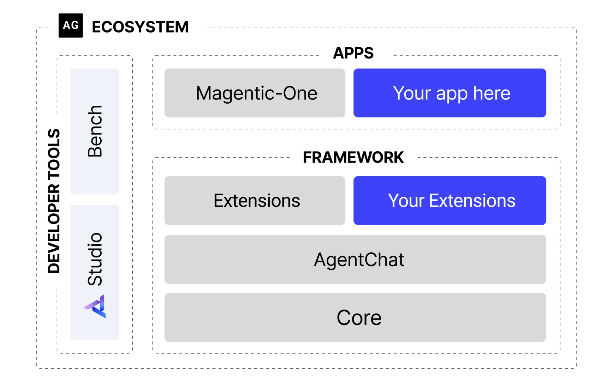
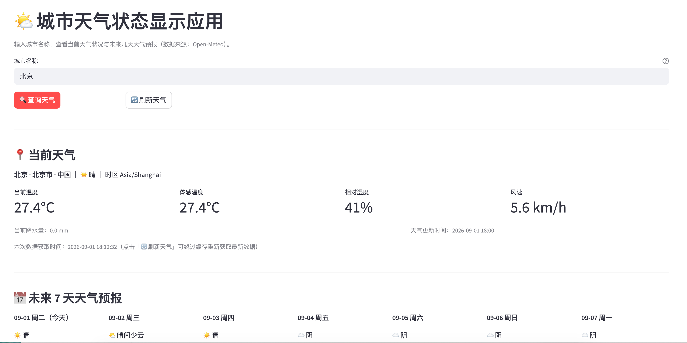

# 本项目是利用AutoGEN框架进行开发应用



从代码层面看，其实整个流程的设计很简单，这也为了后面多agent设计做了铺垫，对不同的任务进行不同的模型调用，比如
- 产品经理智能体，调用时用ChatGPT模型
- 软件工程师智能体，调用claude code模型
- 代码审查员智能体，调用claude code模型
- 用户智能体，写清楚基本的要求就好

以自然的对话驱动写作、角色专业化分工、流程自动化管理和完整的开发闭环

AutoGen的这种框架，将软件开发流程，自然地映射为产品经理、工程师和审查员之间的对话。贴近人类团队的协作模式，显著降低了为复杂任务建模的门槛。

但是存在一些问题：
- 对于这个多智能体去协作时，与模型的对话存在不确定性，若某次对话出现了非预期回复，那可能会导致对话走向意外的分支，甚至无法到达最终目标持续循环。并且调试这个过程会非常棘手。对于中间模型的思考过程，又是一长串对话历史信息，难以去调整。


`python autogen_software_team.py`
会流式输出
```shell
 已完成模块划分
- 已完成 API 封装
- 已完成 Streamlit UI
- 已完成错误处理
- 已完成加载状态
- 已完成刷新功能
- 已完成本地可运行代码
- 已完成验收测试清单

请代码审查员检查
[Prompt tokens: 1649, Completion tokens: 46146]
---------- ModelClientStreamingChunkEvent (CodeReviewer) ----------
<think>我们需要回答用户：用户以中文给出一个团队需求文档，然后提供完整实现方案与代码，最后说“请代码审查员检查”。角色是经验丰富的代码审查专家，审查重点：代码质量、安全性、最佳实践、错误处理。流程：仔细阅读、检查规范、识别问题、提供修改建议、评估整体质量。完成后说固定句“代码审查完成，请用户代理测试”。

我们需要审查代码。必须调用工具，已调用。需要在分析中思考代码问题。然后最终给出具体审查意见，中文，包含优点、问题、严重级别、修改建议、可能修复片段。最后固定句。

需要审查实现：weather_api.py 和 app.py。识别关键问题。

让我们详细审查。

项目结构：app.py, weather_api.py, requirements.txt。Open-Meteo 免费 API。

整体：功能基本满足。代码较完整。问题：

1. 错误处理与状态管理：
- fetch_weather_cached 抛出 WeatherAPIError。Streamlit cache_data 可能会缓存异常？ st.cache_data 会缓存函数返回值，若抛异常不会缓存。可以。
- app 中 query_button 处理：if query_button: should_query=True; st.cache_data.clear()。但 target_city = city.strip()。如果用户输入空，会设置 last_error。
- 自动查询条件：如果 last_data is None and last_error is None and target_city，首次加载会查询默认北京。OK。但设置变化会 reset_query_state，设置 last_data None 等，on_change 后是否 rerun? Streamlit on_change 自动 rerun。可能自动查询。
- 当 query_button 被点击且成功，st.success 条件为 query_button and last_data and not last_error，但 query_button 只在当前脚本运行 True。成功提示会显示。若刷新按钮点击后异常，error 显示。
- 问题：如果 query_button 被点击时 target_city 为空，先设置 last_error，然后后面 if query_button and st.session_state.last_data and not st.session_state.last_error 不会成功。如果 data 是 None，error，st.error。OK。
- 但是 st.cache_data.clear() 在按钮点击时清理所有缓存，包括其他城市缓存；可接受，但影响其他用户? 单用户 session? Streamlit cache_data 默认全局缓存？ cache_data 默认按进程共享？ Streamlit cache_data 缓存是跨会话？在单用户 local 可能。清理所有可能导致其他用户无缓存。建议只清当前城市缓存：st.cache_data.clear() 无法按 key 清理? 可使用 fetch_weather_cached.clear? st.cache_data.clear() only all. Or use ttl short. Or implement cache manually with session_state. But not severe.

2. Streamlit session state and widget key:
- init_session_state sets keys; st.text_input(key="city_input"). Buttons preset_city: if col.button(city_name, use_container_width=True): set st.session_state["city_input"] = city_name. But in Streamlit, widgets are processed every run. For st.text_input key city_input, default from session_state. Setting inside button before st.rerun? st.rerun called after, so new run text_input sees updated value. OK. But widget state? Text input key updated? Setting st.session_state[widget_key] before rerun is allowed. But if not rerun? They call st.rerun. OK.
- Sidebar radio key temperature_unit_label, slider forecast_days, selectbox language_label, all with on_change reset_query_state. However on_change callbacks run before script continues? reset_query_state sets session_state keys last_data etc. It doesn't call st.rerun. Streamlit automatically reruns after widget change? For on_change callback, after callback, script reruns? Yes, widgets trigger rerun. Should work. But radio: st.session_state["temperature_unit"] assigned after radio returns; this assignment is not key tied? OK.
- Potential issue: key="forecast_days" with initial 7; then int(st.session_state["forecast_days"]) later. Good.

3. 数据 API 层：
- _request_json catches requests.exceptions.RequestException, but ResponseError? raise_for_status raises HTTPError subclass RequestException; order Timeout, ConnectionError, HTTPError, RequestException OK. ValueError for json decode? In requests 2.31, Response.json raises requests.exceptions.JSONDecodeError subclass of ValueError? They catch ValueError after RequestException. OK.
- In HTTPError branch: status = getattr(exc.response, "status_code", None); reason try exc.response.json(). If response None? exception response likely not None. OK. But if status is None, suffix. OK.
- search_city: params count: max(1,int(count)). If count int? OK. language lower. If name contains Chinese and language zh? Open-Meteo geocoding may return result with display? OK.
- fetch_weather: city empty raises WeatherAPIError. forecast_days int clamp. temperature_unit handles. It calls search_city then weather params. Good.
- Weather API current includes is_day, but not used. Could use for day/night icons. Minor.
- Units: current_units temperature_2m returns e.g. "°C". OK.
- Forecast daily precipitation_probability_max. If missing? _safe_float None. Good.
- status: success if forecast else partial_success. OK.
- _parse_int(value): int(float(value)). If weather_code is float NaN? float('nan') int error? int(float('nan')) raises ValueError? float(value) returns nan, int(nan) raises ValueError: cannot convert float NaN to integer. _parse_int only catches TypeError, ValueError but not OverflowError. NaN? Could be? Weather code likely int. Safe: return None for math.isnan/isinf. Minor robustness.
- _safe_float same: float('nan') returns nan, not caught. Then UI f-string? For nan, _fmt_with_unit checks value is None then float(value); v = nan. It returns nan formatted? f"{nan:.1f}" = 'nan'. Could show "nan°C". If API missing values None mostly. But NaN possible. Add check math.isfinite. Similar for values.
- _format_datetime: text.replace("Z","+00:00"). If naive local time from Open-Meteo, OK. But datetime.fromisoformat in Python <3.11 may not parse some ISO? It is OK? For 2024-01-02T03:00 etc? They pass current time maybe "2026-01-01T10:00". fromisoformat supports. If "2026-01-01T10:00Z" works. If "2026-01-01 10:00" maybe no T? OK. Exception fallback.

4. Security:
- HTML injection: They escape most text with _safe_text. Good. However hero_html includes st.session_state.get('last_fetched_local') escaped. OK.
- Weather condition and city escaped. G
```


运行结束后：
```shell
================================================================================
📋 协作结果摘要
================================================================================
- Agent 数量：3
- ProductManager：需求规划
- Engineer：开发与修复
- CodeReviewer：代码审查
- 最终状态：✅ REVIEW PASSED
```

如何运行app呢？
```shell
cd workspace
pip install -r requirements.txt
streamlit run app.py
```

